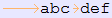
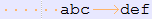
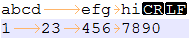
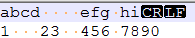

## 1.命令简介
expand 用于将文件的制表符（Tab）转换为空格符（Space）。

默认一个 Tab 对应 8 个空格符，并将结果输出到标准输出。若不指定任何文件名或所给文件名为 -，则 expand 会从标准输入读取数据。

功能与之相反的命令是 unexpand，是将空格符转成 Tab 符。

## 2.命令格式
```
expand [OPTIONS] [FILES]
```

## 3.选项说明
```
-i, --initial
	不转换非空白符后的制表符
-t, --tabs=NUMBER
	指定一个tab替换为多少个空格，而不是默认的 8
-t, --tabs=LIST
	指定制表符位置列表，用逗号分隔
--help
	显示帮助信息
--version
	输出版本信息
```

## 4.常用示例
（1）将文件中每行第一个 Tab 符替换为 6 个空格符，非空白符后的制表符不作转换。
```
expand -i -t 6 FILE
```
原文件内容：



转换后内容如下：



## 5.常见问题
（1）不是所有的 Tab 都会转换为默认或指定数量的空格符，expand 会以对齐为原则将 Tab 替换为适当数量的空格符，替换的原则是使后面非 Tab 符处在一个物理 Tab 边界（即 Tab size 的整数倍）。

例如下面的文件：



其中 CR 和 LF 分别是 Windows 下的回车和换行符。使用如下命令转换后的结果如下图：
```
expand -t 4 file
```


可以看到第一行的第二个 Tab 符和第二行的所有 Tab 符并没有替换为 4 个空格符，还是按照原来内容的对齐格式，替换为适当数量的空格符。

---
## 参考文献
[expand(1) - Linux manual page - man7.org](http://man7.org/linux/man-pages/man1/expand.1.html)

[缩进与对齐——正确地使用Tab和空格](https://blog.csdn.net/tonywearme/article/details/7061530)
